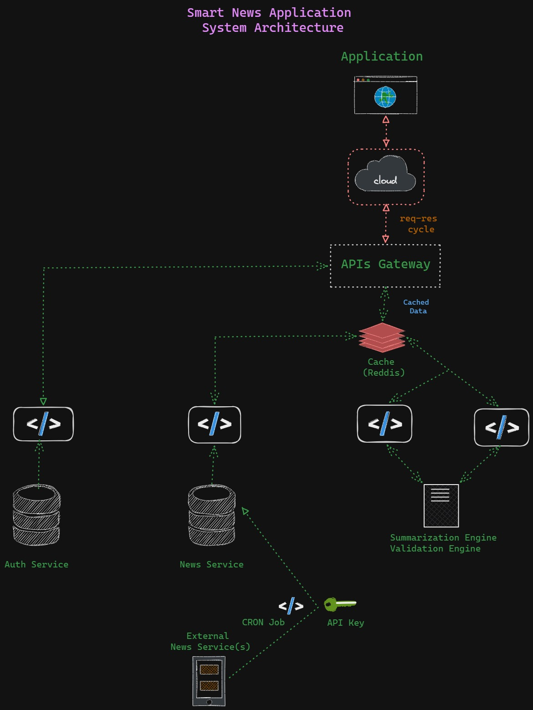
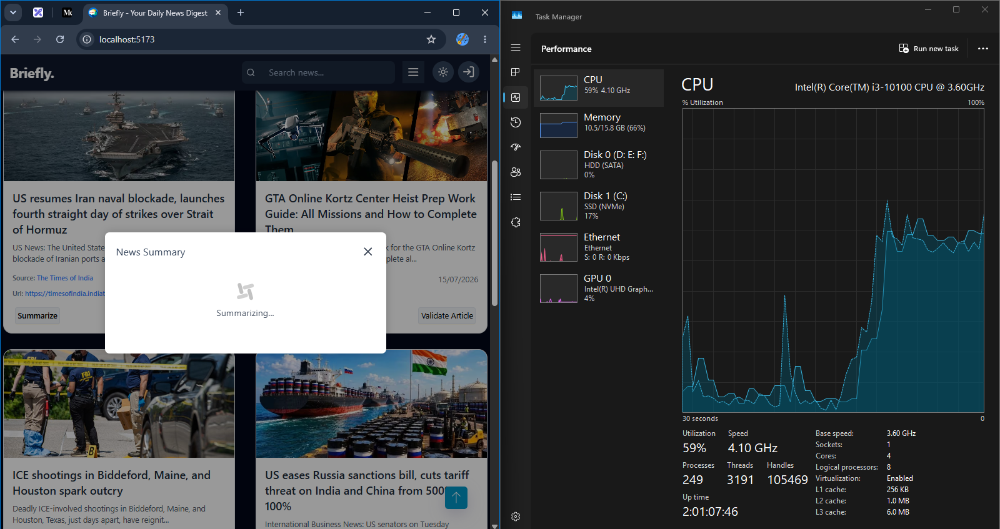
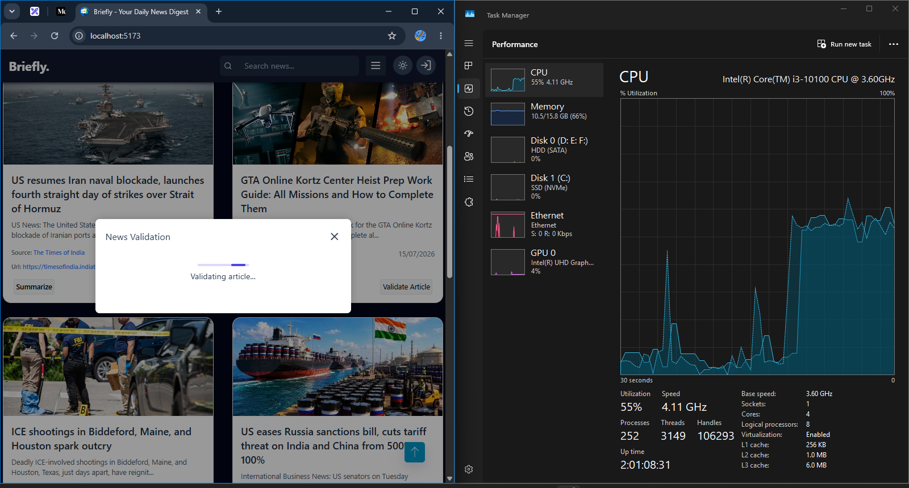

# 📰 Smart-News-App

A **Smart News App** that leverages **AI for real-time summarization and fact validation**, ensuring concise,
accurate, and trustworthy news updates - all in one place.

**About this** -> 
The important design decision is separation of concerns. The frontend does not call the
Python AI services directly. It calls the Express backend, and the backend proxies requests
to the correct Python service. This keeps service URLs, AI implementation details, and
future security controls on the server side.

---

## 🚀 Overview

**Smart News App** is an AI-powered platform that collects news from multiple sources and uses **Natural Language
Processing (NLP)** to:
- Summary Service Modules
  - Generate **real-time summaries** using Ollama qwen3:0.6b *(Locally Dockerized Summary Engine)*.
  This project defines a specialized prompt for generating concise news summaries. The prompt ensures the model behaves like an experienced editor and follows strict rules:

    1. Word limit: Summaries capped at 100 to 150 words.
    2. Neutral tone: No bias or opinions.
    3. Fact preservation: Information must remain accurate.
    4. No hallucinations: Only verifiable details included.
    5. Key details: Important names, organizations, locations, and dates must be mentioned.

This prompt is critical for maintaining style consistency and safety in generated summaries, ensuring trustworthy and professional outputs.

- ✅ Perform **fact validation** to check the authenticity of news *(Locally Dockerized Summary Engine)*.
- Validation Service Modules
  - Validate the request body.
  - Extract article text.
  - Extract article URL or fallback source URL.
  - Normalize the source domain.
  - Run source credibility analysis.
  - Extract factual claims using the LLM.
  - Extract keywords using the LLM.
  - Return a structured response to the backend

- 🔎 Provide **personalized recommendations** for readers.
- ⚖️ Ensure **unbiased and credible** information delivery. It’s built for users who want quick insights without compromising accuracy.
---

**System Design and Architecture of Application**

---

## 🧩 Features

- 📰 Smart Aggregation: Fetches news from verified APIs and trusted sources.
- ⚡ AI Summarization: Uses Ollama qwen3:0.6b model for high-quality text summaries.
- 🧾 Fact Validation: Cross-verifies claims and information for reliability through validation engine.
- 🌐 User-Friendly Interface: Built with a responsive React frontend and Tailwind CSS.
- ⚙️ Modular Architecture: Node.js + Express backend with Python-based AI microservices.
- 💡 Performance Insights: Includes local CPU load analysis and model optimization learnings.
- 👤 Authentication System: Secure login with email, password, and OTP via mail. Supports location preferences for countries: IN, US, RU, UK, CN.

---

## 🧠 Tech Stack

| Layer       | Technology                         |
|-------------|------------------------------------|
| Frontend    | React.js, Tailwind CSS             |
| Backend     | Node.js, Express.js                |
| AI Services | Python (Ollama qwen3:0.6b, Flask) |
| Database    | MongoDB                            |
| Others      | REST APIs, Axios                   |          

## 🖼️ Screenshots & Demo

* Home Page
  
* Authentication
  
* Auth Code via mail 
  
* User Account 
  
* Summarization
  
* News Article Validation in Action
  
* Article Validation
  
* CPU High Utilization while running summarization and validation engine *(locally implementation)*
  

  

  *(Screenshots illustrate live summarization, validation, and performance testing with CPU metrics.)*

--- 

## 📊 Performance & Optimization

While running **local summarization** using **Ollama qwen3:0.6b**,, I observed a **CPU utilization spike (~50%) even (~70% sometimes)** on
an Intel i3-10100 processor.  
This led to valuable learning about **AI inference optimization**

Steps including to optimize system :
- Caching models in memory to avoid reloading on each request
- Storing summaries using hashed content keys
- Applying **model quantization** (int8 / fp16) with ONNX Runtime
- Exploring **GPU acceleration** and **asynchronous processing** for smoother performance

> 💬 These insights are helping me dive deeper into optimizing local AI workloads for production-level efficiency.

---

## 🧑‍💻 Learning Journey

This project is part of my ongoing exploration in:

- **AI integration in full-stack systems**
- **Performance optimization of local inference models**
- **System design and scalability for real-world applications**

Currently, I’m experimenting with caching layers, Ollama qwen3:0.6b or other open source LLM variants, and model distillation to enhance efficiency
and response times.

> 🚀 The goal is to make local AI summarization as fast and lightweight as cloud inference - without losing accuracy.

---

🚀 Project Highlights Updates – 
- **Model Upgrade**: Transitioned from Facebook BERT to Ollama qwen3:0.6b, ensuring concise, consistent, and neutral summaries.
- **Ethical Summarization**: Implemented standard prompt practices to guarantee unbiased outputs.
- **Dual Engines**: Built and dockerized both news validation and summarization engines powered by LLM Ollama qwen3:0.6b.
- **Validation Flow**:
    - Validation Service
    - Claim extraction using LLM
    - Keyword extraction using LLM
    - Source credibility check via trusted_sources.json
    - Structured validation JSON
    - React News Validation modal

- **Search Functionality**: Integrated search for quick access to relevant articles.
- **UI Themes**: Designed responsive React frontend with Tailwind CSS, supporting multiple themes.
- **Authentication**: Secure login with email, password, and OTP via mail, plus location preferences for IN, US, RU, UK, CN.
- **Performance Insights**: Conducted CPU load analysis and model optimization for efficiency.

---

## 📚 Future Scope

- 🚀 **Model Optimization:** Improve summarization performance using **ONNX Runtime** and **TensorRT** for faster and
  lighter inference.
- 🧩 **Caching & Pipeline Persistence:** Implement intelligent caching and persistent pipelines to avoid recomputation
  for repeated summaries.
- ☁️ **Hybrid Cloud + Edge Inference:** Combine local AI inference with cloud-based scalability for optimized resource
  usage and real-time response.
- 🔐 **Advanced Fact Validation:** Enhance fact-checking accuracy using multi-source validation and cross-reference APIs.
- 👤 **User Accounts & Personalization:**  Introduce secure **user authentication** and **profile-based customization**
  to deliver personalized news feeds, topic recommendations, and preference-driven summaries.

---

## 🏁 Conclusion

Building this project has been an exciting hands-on experience in connecting AI + Web Development + System Design.
It not only delivers useful functionality but also opened up deep learning opportunities around AI model optimization,
inference caching, and performance profiling.

💬 “Optimization is not just about speed - it’s about designing smarter systems.”